# Open Knowledge Mapping

**Antarmuka visual untuk menjelajahi pengetahuan ilmiah.** Ketik sebuah topik atau judul penelitian; aplikasi merayapi (crawl) sumber publik secara *real-time* — Garuda, SINTA/ARJUNA, dan OpenAlex — lalu mengekstrak topik yang diteliti, memetakan keterkaitannya dalam *bubble map* interaktif, dan menunjukkan tren, celah penelitian, jurnal yang cocok, hingga draf naskah. Setiap data dapat ditelusuri kembali ke sumber aslinya.

**Cari → Crawl → Analisis → Visualisasi → Eksplorasi.** Tanpa database, tanpa login, tanpa riwayat pencarian.

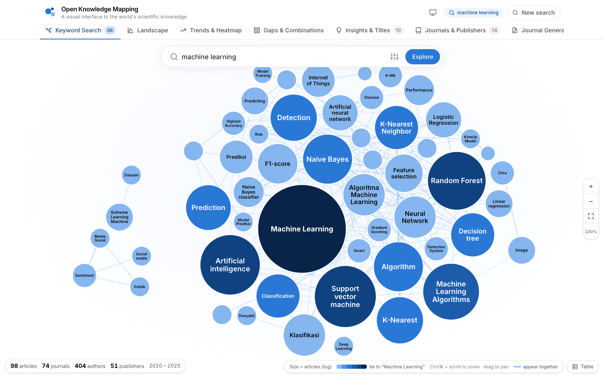

## Tim

| Peran | Nama |
|---|---|
| Arsitek Aplikasi | **Rizky Musthofa** |
| Asisten Pemrogram | **AI Agent** |

---

## Daftar isi

1. [Fitur](#fitur)
2. [Tangkapan layar](#tangkapan-layar)
3. [Menjalankan aplikasi](#menjalankan-aplikasi)
4. [Deploy ke server (satu domain)](#deploy-ke-server-satu-domain)
5. [Arsitektur](#arsitektur)
6. [Sumber data & etika crawling](#sumber-data--etika-crawling)
7. [Metode analisis](#metode-analisis)
8. [API](#api)
9. [Konfigurasi](#konfigurasi)
10. [Pengujian](#pengujian)
11. [Privasi](#privasi)
12. [Batasan yang diketahui](#batasan-yang-diketahui)

---

## Fitur

| Tab | Isi |
|---|---|
| **Keyword Search** | Peta bubble layar penuh yang tumbuh *live* selama crawling; zoom & geser; klik bubble → overlay daftar artikel dan jurnal; filter (tahun, SINTA, kategori, penerbit, jurnal, sumber) tanpa crawl ulang; *Closest published papers*; daftar artikel dengan detail sumber per kolom; ekspor CSV/JSON |
| **Landscape** | Peta tema penelitian: artikel dikelompokkan berdasarkan kemiripan makna (embedding lokal) dan diberi nama dengan kata kunci paling khas |
| **Trends & Heatmap** | *Emerging topics* (pertumbuhan dibanding periode sebelumnya, topik baru) dan heatmap kata kunci × tahun / tingkat SINTA / kategori |
| **Gaps & Combinations** | *Research Gap Explorer* (pasangan kata kunci yang jarang bertemu), matriks ko-okurensi vs. ekspektasi, dan *Topic Combination* (pilih 2–3 kata kunci); tombol **Verify on sources** mengecek jumlah dokumen langsung ke Garuda & OpenAlex |
| **Insights & Titles** | Rekomendasi judul berbasis data (aplikasi, tren, celah, review) lengkap dengan bukti; rekomendasi tingkat SINTA; skor kecocokan topik jurnal & penerbit |
| **Journals & Publishers** | Direktori jurnal dan penerbit dari hasil pencarian: peringkat SINTA, kategori, ISSN, tautan situs/SINTA/Garuda |
| **Journal Generate** | Templat naskah format SINTA/IMRaD (Indonesia/Inggris, APA/IEEE) dengan referensi asli dari hasil crawl; ekspor Word/Markdown |
| **Report** | Laporan riset lengkap satu dokumen; ekspor Word, Markdown, atau cetak/PDF |

Fitur pendukung:

- **Pencarian judul panjang.** Judul lengkap dicoba lebih dulu; bila hasilnya sedikit, judul dipecah menjadi konsep inti (mis. “eksplorasi topik”, “web crawling”) plus padanan bahasa Inggris, lalu hasilnya digabung.
- **Multi-sumber.** Garuda (jurnal Indonesia) dan OpenAlex (indeks global, dapat dibatasi ke penulis dari institusi Indonesia) berjalan paralel; duplikat (DOI/judul sama) digabung.
- **Kemiripan semantik.** Model embedding multibahasa berjalan di server sendiri — tanpa API key, tanpa mengirim data ke pihak ketiga — untuk mengukur kemiripan makna antara kata kunci/judul Anda dan tiap artikel (lintas bahasa Indonesia–Inggris).
- **Fokus kategori.** 10 bidang resmi SINTA (Teknik, Sains, Kesehatan, Pertanian, Ekonomi, Pendidikan, Sosial, Humaniora, Agama, Seni).
- **Peringkat SINTA S1–S6** dari SK akreditasi ARJUNA.
- **Tahan gangguan.** Bubble langsung muncul saat data pertama tiba; bila sumber gagal atau koneksi putus, data yang sudah terkumpul tetap ditampilkan.
- **Dark & light mode** (mengikuti sistem atau dipilih manual); semua tautan sumber dibuka di tab baru.

## Tangkapan layar

| | |
|---|---|
| 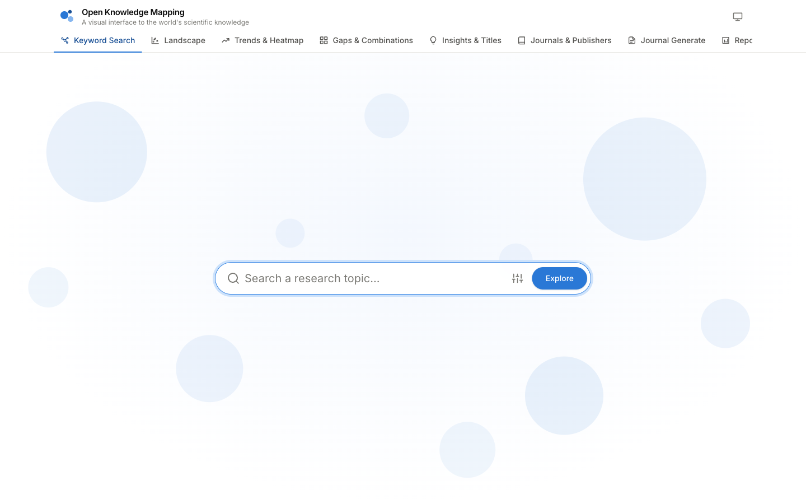 **Beranda** — fokus pada kotak pencarian; opsi (kategori, jumlah artikel, sumber) di tombol *Options* | 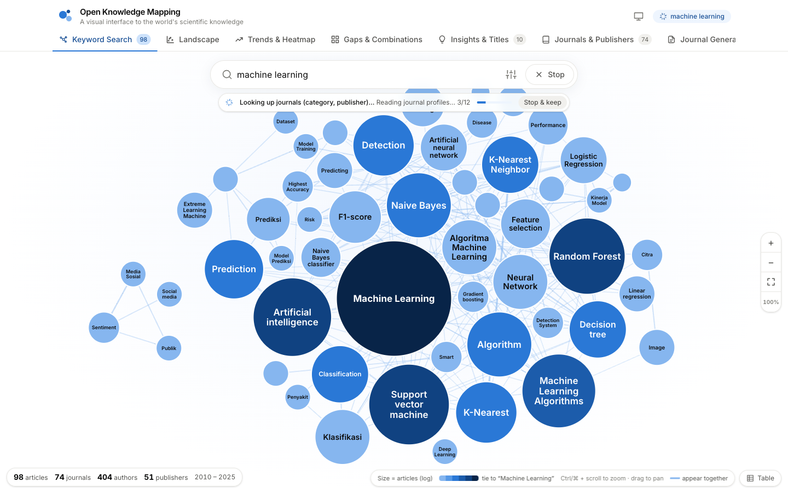 **Crawling live** — bubble muncul dan bertambah selama pencarian berjalan |
| 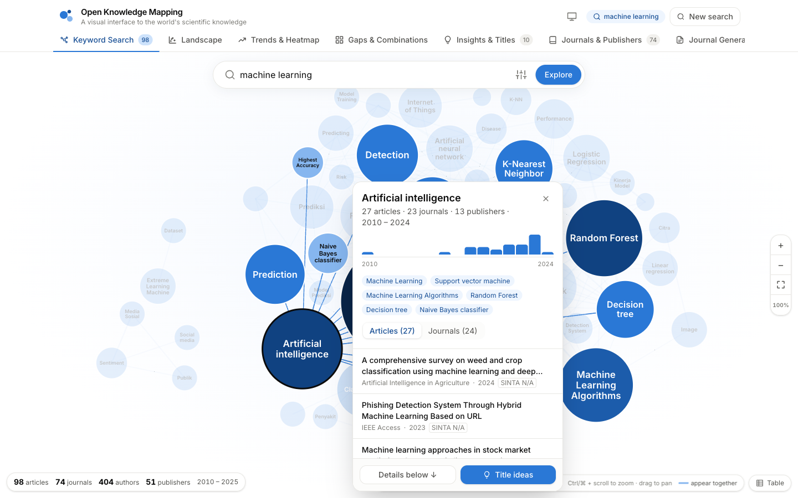 **Klik bubble** — daftar artikel & jurnal untuk topik tersebut | 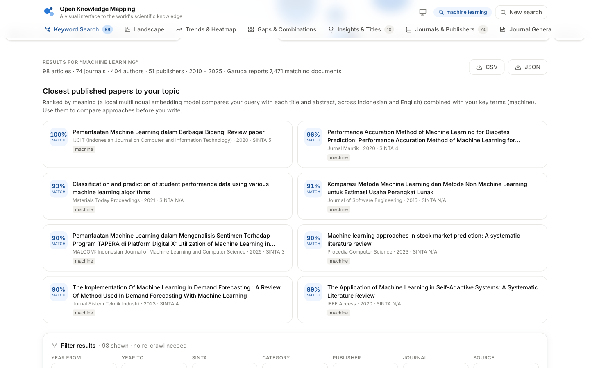 **Closest published papers** — kemiripan makna + kata kunci |
| 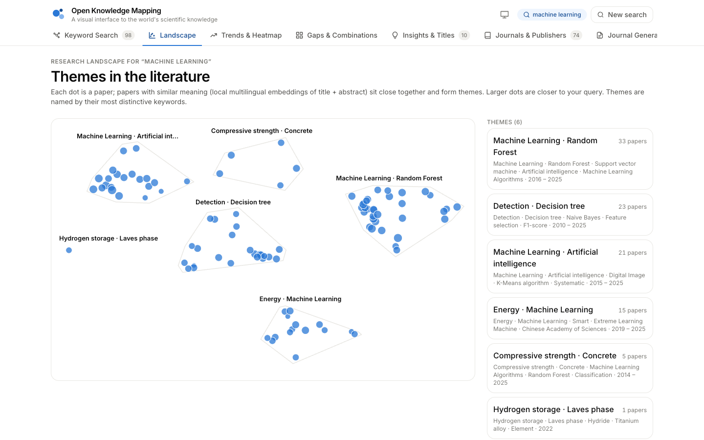 **Landscape** — tema penelitian dari embedding | 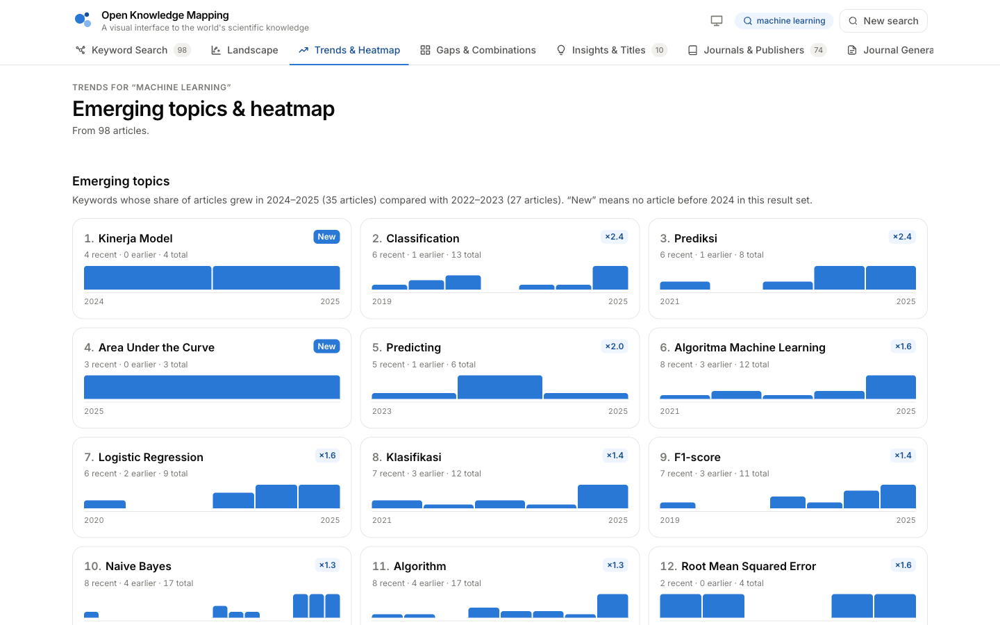 **Trends & Heatmap** — topik yang sedang naik |
| 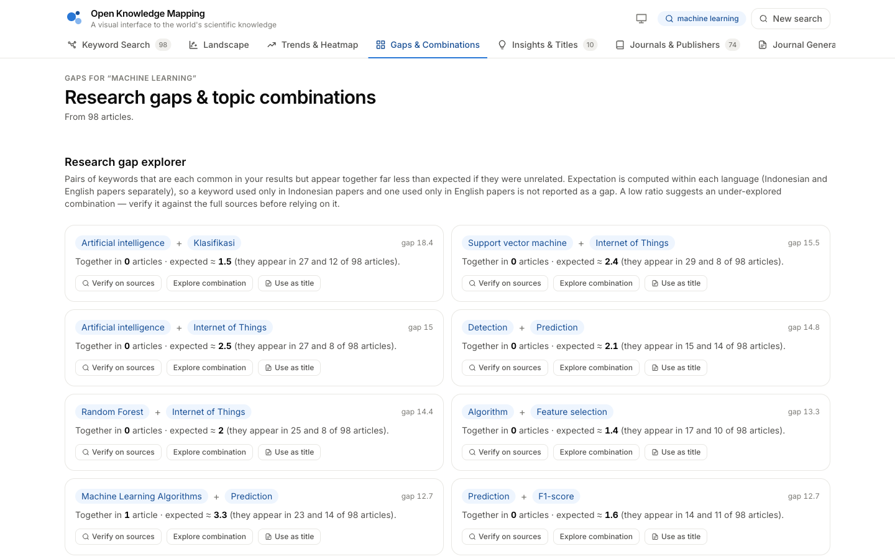 **Gaps & Combinations** — kandidat celah penelitian | 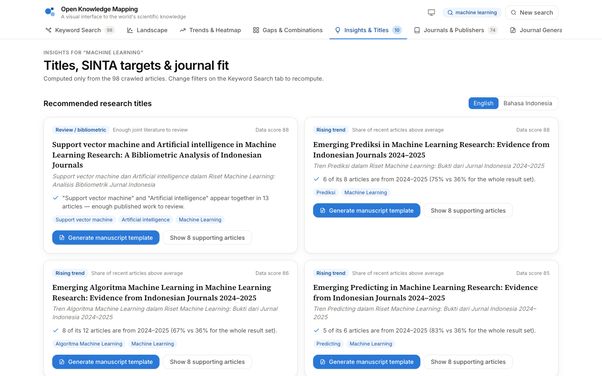 **Insights & Titles** — rekomendasi judul & jurnal |
| 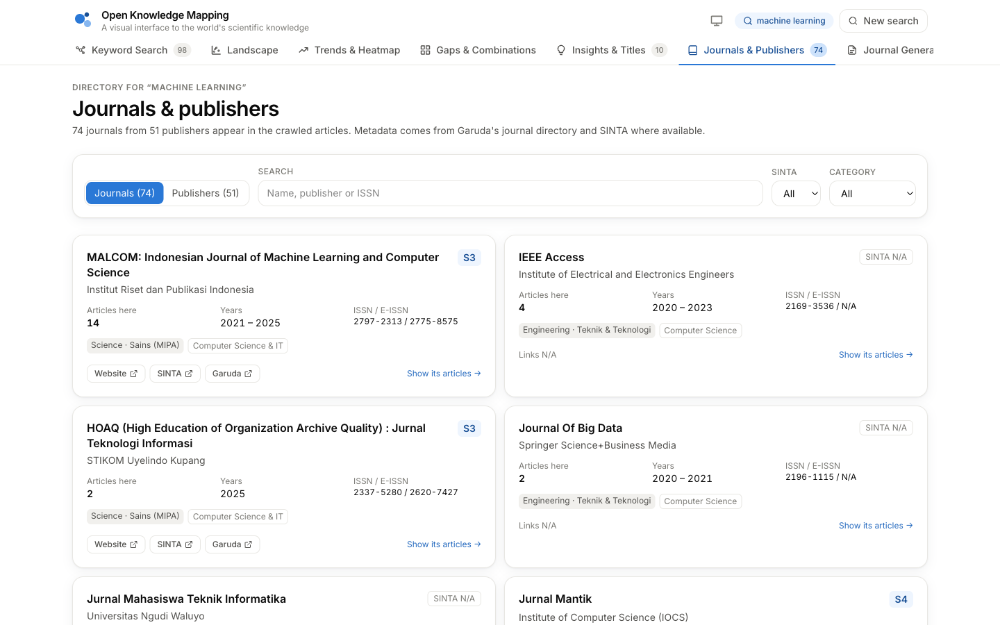 **Journals & Publishers** | 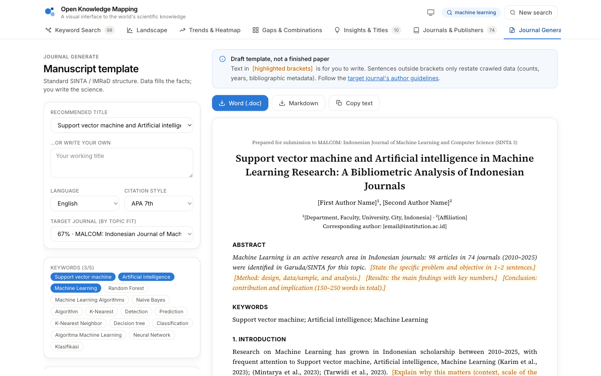 **Journal Generate** — templat naskah SINTA/IMRaD |
| 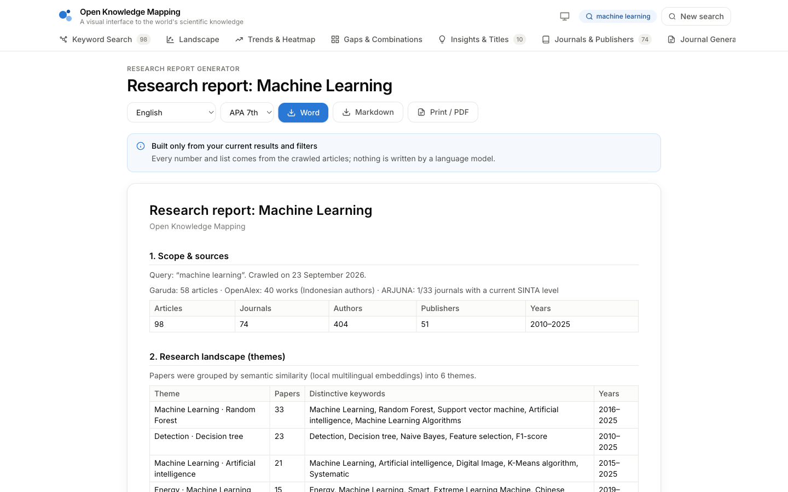 **Report** — laporan riset satu dokumen | 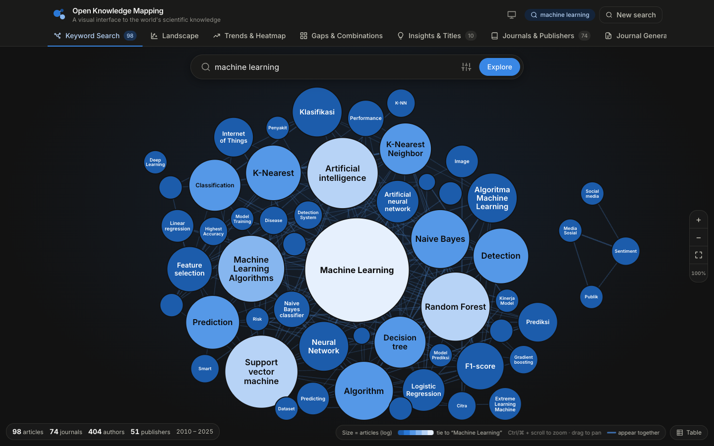 **Dark mode** |

Tangkapan layar dibuat otomatis dari aplikasi yang berjalan: `npm run screenshots` (lihat [Pengujian](#pengujian)).

## Menjalankan aplikasi

Prasyarat: **Node.js 20+** dan koneksi internet.

```bash
npm install
npm run dev
```

- UI: http://localhost:5173 · API: http://localhost:5174
- `npm install` juga mengunduh Chromium untuk Puppeteer.
- Model embedding (±130 MB) diunduh otomatis sekali saat server pertama kali berjalan, disimpan di `server/.models/`.

Mode produksi (satu proses, UI + API di port yang sama):

```bash
npm run build
npm start
```

## Deploy ke server (satu domain)

Cukup **satu domain**. `npm run build` mengubah `client/` menjadi file statis, dan server Express melayani UI sekaligus API:

```
https://domain-anda.com/        → UI (React)
https://domain-anda.com/api/... → API + crawler
```

Contoh Nginx — `proxy_buffering off` wajib agar progres dan bubble tampil *live* (Server-Sent Events):

```nginx
server {
    server_name domain-anda.com;
    location / {
        proxy_pass http://127.0.0.1:5174;
        proxy_http_version 1.1;
        proxy_set_header Host $host;
        proxy_buffering off;
        proxy_cache off;
        proxy_read_timeout 600s;
    }
}
```

Catatan server Linux: Chromium membutuhkan pustaka sistem (mis. `libnss3 libatk-bridge2.0-0 libgbm1 libxkbcommon0 libasound2`), dan RAM minimal ±2 GB (Chromium + model embedding). Gunakan PM2/systemd agar proses tetap berjalan.

## Arsitektur

```
Browser (React + Vite + Tailwind + D3)
  │  EventSource  GET /api/search/stream  ← plan · progress · articles (live) · result
  ▼
Node.js / Express
  │  searchService — tahapan terisolasi; kegagalan satu tahap menjadi peringatan
  ├─ crawlers/  GarudaCrawler · OpenAlexCrawler · SintaCrawler · ArjunaCrawler · journalCrawler
  ├─ parsers/   garudaParser · sintaParser · journalParser        (cheerio)
  ├─ services/  journalResolver · dataNormalizer · resultAggregator · semantic · landscape
  └─ utils/     browser (Puppeteer + fetchJson) · rateLimiter · robots · urlValidator
  ▼
Sumber publik: Garuda · SINTA · ARJUNA · OpenAlex · situs jurnal (OJS)

shared/  (dipakai server DAN browser)
  keywordAnalyzer · queryPlanner · aggregate · insights · trends · categories · stopwords
```

```
package.json               npm workspaces; `npm run dev` menjalankan server + client
shared/                    logika analisis murni (tanpa I/O)
server/src/
  server.js, routes/, controllers/
  config/crawler.js        semua batas: timeout, rate limit, anggaran waktu
  crawlers/  parsers/  services/  utils/
server/certs/              sertifikat perantara publik (lihat bagian sumber data)
server/test/               pengujian + fixture halaman asli
client/src/
  App.jsx                  state, stream live, analitik di memori
  tabs/                    Search, Landscape, Trends, Gaps, Insights, Journals, Generate, Report
  components/  lib/
scripts/take-screenshots.mjs
docs/screenshots/
```

**Alur pencarian**

1. **Rencana kueri** — kata kunci pendek dicari langsung; judul panjang dipecah menjadi konsep.
2. **Garuda + OpenAlex** paralel, halaman demi halaman; tiap halaman langsung dikirim ke browser sehingga bubble tumbuh *live*.
3. **Pencarian jurnal** — direktori Garuda (ISSN, penerbit, kategori) dan profil jurnal (situs, tautan SINTA) untuk jurnal teratas; sisanya dimuat saat dibutuhkan.
4. **Akreditasi** — tingkat SINTA dari keputusan ARJUNA, per jurnal, dikirim bertahap.
5. **Opsional** — kata kunci penulis dari halaman artikel (meta tag OJS).
6. **Akhir** — normalisasi, deduplikasi, ekstraksi kata kunci, agregasi, kemiripan semantik, dan lanskap tema.

## Sumber data & etika crawling

| Sumber | Akses | Dipakai untuk |
|---|---|---|
| **Garuda** (garuda.kemdiktisaintek.go.id) | Halaman publik | Artikel (judul, penulis, abstrak, jurnal, penerbit, DOI, URL asli); direktori jurnal |
| **ARJUNA** (arjuna.kemdiktisaintek.go.id) | API publik halaman depan | **Peringkat SINTA S1–S6** = peringkat pada SK akreditasi terbaru; SK > 5 tahun dianggap kedaluwarsa |
| **OpenAlex** (openalex.org) | API resmi, data CC0 | Artikel global/Indonesia dengan abstrak, topik, dan bidang |
| **SINTA** (sinta.kemdiktisaintek.go.id) | Menolak crawler otomatis (HTTP 403) | Dicoba untuk jurnal bertopik; bila ditolak, host dijeda 15 menit |
| **Situs jurnal (OJS)** | Halaman publik | Kata kunci penulis dari meta tag (mode opsional) |

Prinsip crawling:

- Hanya data publik; tanpa login, tanpa melewati CAPTCHA atau mekanisme keamanan.
- Crawler **mengidentifikasi diri secara jujur** dan tidak menyamar sebagai browser. Bila sebuah situs menolak, situs itu dianggap tidak tersedia.
- `robots.txt` diperiksa untuk setiap host dan *Crawl-delay* dihormati.
- Batas laju per host (0,25–1 detik antar-permintaan, 1–2 paralel), batas halaman browser, timeout, dan retry hanya untuk galat sementara.
- API resmi (ARJUNA, OpenAlex) diutamakan dibanding scraping HTML.
- Server `apiarjuna.kemdiktisaintek.go.id` tidak mengirim sertifikat perantaranya (browser mengambilnya otomatis, Node tidak). `server/certs/intermediates.pem` berisi sertifikat perantara publik Sectigo agar Node tetap memverifikasi rantai sertifikat sampai ke root — verifikasi TLS **tidak** dimatikan.

Data yang tidak tersedia ditampilkan sebagai **N/A**; tidak ada data yang dikarang. Setiap artikel memiliki panel *Source details* yang menyebut sumber tiap kolom.

## Metode analisis

**Ekstraksi kata kunci**

1. Kata kunci penulis (baris “Keywords/Kata kunci” pada abstrak, meta tag artikel, kata kunci OpenAlex dengan skor ≥ 0,5).
2. Frasa 1–4 kata dari judul dan abstrak, dipecah pada *stopword* bahasa Indonesia & Inggris; kata tunggal hanya dari judul.
3. Normalisasi: “Machine Learning / machine-learning / MACHINE LEARNING” → `machine learning`; hanya kata terakhir yang dibuat tunggal; akronim yang didefinisikan di teks (“Support Vector Machine (SVM)”) digabung dengan kepanjangannya.
4. Kata kunci harus muncul di ≥ 2 artikel; frasa pendek dibuang bila frasa yang lebih panjang mencakup ≥ 90% artikelnya; potongan kata kunci pencarian dibuang.

**Ukuran bubble** — `radius = skala linear dari log(jumlah artikel + 1)`. Warna = kekuatan ko-okurensi (Jaccard) dengan kata kunci pencarian pada satu gradasi biru (palet terpisah untuk mode gelap). Garis = kata kunci yang muncul di artikel yang sama.

**Kemiripan dengan kueri** — `0,6 × kemiripan semantik (dinormalisasi) + 0,4 × skor kata kunci`, dengan skor kata kunci = `0,6 × konsep yang muncul utuh + 0,4 × istilah yang muncul`. Model: `Xenova/paraphrase-multilingual-MiniLM-L12-v2` (lokal).

**Lanskap tema** — embedding judul+abstrak → k-means kosinus (k = √(n/3), 2–8) → nama tema dari kata kunci paling khas (TF-IDF per klaster) → posisi: proyeksi PCA pusat tema, tema dipisahkan agar tidak tumpang tindih, artikel diletakkan di dalam temanya.

**Emerging topics** — porsi artikel sebuah kata kunci pada 2 tahun terakhir dibanding 2 tahun sebelumnya (dengan *smoothing*); “New” = belum muncul sebelumnya.

**Research gap** — pasangan kata kunci dengan `observed / expected < 0,5`, di mana `expected` dihitung **per bahasa** (Σ countₗ(A)·countₗ(B)/Nₗ) agar istilah berbahasa berbeda tidak dianggap celah.

**Kecocokan jurnal** — `(0,45·relevansi + 0,35·kecocokan kata kunci + 0,20·kebaruan) × selektivitas tingkat SINTA`. **Bukan** tingkat penerimaan; tidak ada sumber publik yang menerbitkan tingkat penerimaan jurnal.

Semua rekomendasi (judul, tingkat SINTA, jurnal, laporan) dihitung hanya dari hasil pencarian saat itu, disertai buktinya.

## API

| Endpoint | Keterangan |
|---|---|
| `GET /api/search/stream?q=…&limit=100&category=engineering&sources=garuda,openalex&scope=id&deep=1` | Server-Sent Events: `plan`, `progress`, `articles`, `ping`, lalu `result` atau `failure` |
| `GET /api/search?q=…` | Pipeline yang sama, satu respons JSON |
| `GET /api/count?q=…&scope=id` | Jumlah dokumen di Garuda dan OpenAlex (verifikasi celah) |
| `GET /api/journal-profile?url=https://garuda.kemdiktisaintek.go.id/journal/view/123` | Situs, tautan SINTA, dan bidang satu jurnal |
| `GET /api/meta` | Batas, kategori, sumber |

`limit` ∈ 25/50/100/250/500. `scope` = `id` (OpenAlex hanya karya dengan penulis dari institusi Indonesia) atau `global`.

Ringkasan hasil (`result`):

```jsonc
{
  "query": "machine learning",
  "summary": { "articles": 98, "journals": 74, "authors": 404, "publishers": 51, "yearMin": 2010, "yearMax": 2025,
               "byRank": { "S1": 0, "S2": 6, "…": 0 }, "byCategory": { "engineering": 40 }, "byYear": { "2024": 20 } },
  "keywords": [{ "id": "random forest", "name": "Random Forest", "count": 13, "journals": 12, "related": [] }],
  "links": [{ "source": "machine learning", "target": "random forest", "weight": 13, "jaccard": 0.31 }],
  "articles": [{
    "title": "…", "authors": ["…"], "abstract": "…", "journalName": "…", "publisherName": "…",
    "publicationYear": 2025, "sintaRank": "S3", "accreditation": { "grade": "S3", "decree": "79/E/KPT/2023" },
    "doi": "10.…", "articleUrl": "…", "sintaUrl": "…", "garudaUrl": "…", "openalexUrl": "…",
    "categories": ["engineering"], "source": "Garuda", "semantic": 0.66, "relevance": 0.5,
    "provenance": { "sintaRank": "ARJUNA (SK 79/E/KPT/2023, 2023-05-11)", "authors": "Garuda" }
  }],
  "landscape": { "method": "embedding", "clusters": [], "points": { "<id>": { "x": 0.4, "y": 0.6, "cluster": 2 } } },
  "meta": { "plan": {}, "sources": {}, "warnings": [] }
}
```

## Konfigurasi

Variabel lingkungan (semua opsional; lihat `server/src/config/crawler.js`):

| Variabel | Bawaan | Fungsi |
|---|---|---|
| `API_PORT` | `5174` | Port server |
| `MAX_CONCURRENT_SEARCHES` | `2` | Pencarian yang berjalan bersamaan |
| `HOST_DELAY_MS` | `1000` | Jeda minimum antar-permintaan ke host yang sama |
| `OPENALEX_MAILTO` | – | E-mail kontak untuk *polite pool* OpenAlex |
| `SEMANTIC` | `on` | `off` untuk menonaktifkan model embedding |
| `SEMANTIC_MODEL` | `Xenova/paraphrase-multilingual-MiniLM-L12-v2` | Model embedding lokal |
| `CRAWLER_USER_AGENT` | identitas jujur aplikasi | User-Agent crawler |

## Pengujian

```bash
npm test
```

Pengujian mencakup parser (dengan halaman Garuda/SINTA asli sebagai fixture), normalisasi & ekstraksi kata kunci, perencanaan kueri, kemiripan, OpenAlex, lanskap, tren, celah, robots.txt, dan keamanan URL.

Membuat ulang tangkapan layar README (aplikasi harus sedang berjalan):

```bash
BASE_URL=http://localhost:5174 npm run screenshots
```

## Privasi

- Tidak ada database dan tidak ada penyimpanan permanen; hasil hanya ada di memori selama permintaan berjalan (plus cache metadata jurnal publik 30 menit di memori server).
- Browser menyimpan hasil terakhir di `sessionStorage` tab tersebut agar tidak perlu crawl ulang saat halaman dimuat ulang; data terhapus saat tab ditutup.
- Pilihan tema disimpan di `localStorage` browser.
- Model embedding berjalan di server sendiri; judul/abstrak tidak dikirim ke layanan pihak ketiga.
- Ekspor (CSV, JSON, Word, Markdown) dibuat di browser.

## Batasan yang diketahui

- SINTA menolak akses otomatis, sehingga jurnal yang tidak tercatat di ARJUNA (mis. jurnal terindeks Scopus yang diberi S1 langsung oleh SINTA) tampil **N/A**.
- Sumber mengembalikan hasil berdasarkan relevansi, bukan sensus; tren dan celah menggambarkan sampel yang di-crawl. Naikkan *Max articles* untuk hasil yang lebih stabil.
- Kata kunci berbahasa Indonesia dan Inggris dengan arti sama (mis. “Klasifikasi” dan “Classification”) masih tampil sebagai bubble terpisah.
- Pencarian 100 artikel membutuhkan ±1 menit sampai selesai karena laju permintaan dibatasi dengan sopan; bubble sudah muncul jauh sebelumnya.
